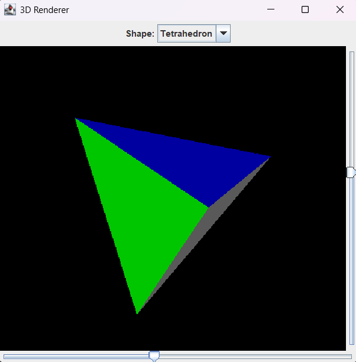
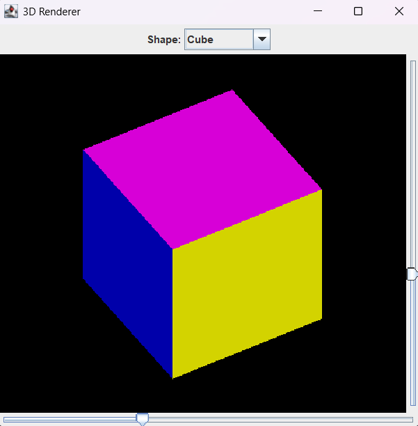

# 3D Renderer

A simple software 3D rasterizer in pure Java (Swing/AWT). Pick a shape, rotate it with heading and pitch sliders, and watch triangles fill with z-buffering and flat shading.

The rendering core follows [How to create your own simple 3D render engine in pure Java](http://blog.rogach.org/2015/08/how-to-create-your-own-simple-3d-render.html) by Rogach (orthographic projection, triangle rasterization, z-buffer, flat shading). This project extends that base into a small app: package layout, a shape catalog, and a UI to switch meshes.

## Screenshots

Tetrahedron selected, rotated with the heading/pitch sliders:



Cube selected from the shape dropdown:



## Run

```bash
mvn compile exec:java
```

Or run `org.example.renderer.Main` from your IDE (Java 24).

## Layout

```
org.example.renderer/
├── Main.java              # entry point
├── app/                   # Swing UI (window, sliders, shape combo)
├── math/                  # Vertex, Matrix3
├── mesh/                  # Triangle, Mesh, Shapes catalog
├── render/                # rasterizer + shading
└── scene/                 # active mesh + view transform
```

## Credits

- Tutorial / technique base: [Rogach — How to create your own simple 3D render engine in pure Java](http://blog.rogach.org/2015/08/how-to-create-your-own-simple-3d-render.html)
